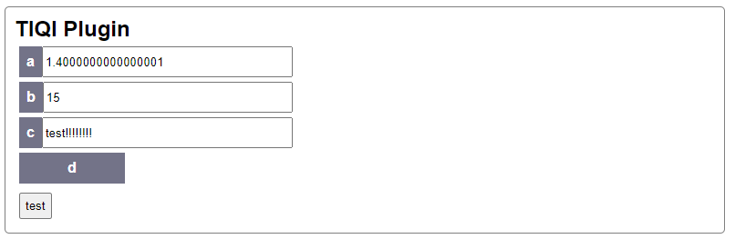

# Getting Started

The general idea behind `slapdash` is that it can take python classes with arbitrary structure and automatically create a server exposing its attributes and method to remotely control it. It also provides a web frontend for immediate access.

Consider the following example, which can be found in `examples/simple.py`

```python
class Simple:
    a = 0.0
    b = 1
    c = "test"
    d = False
```

The plugin is generated by `slapdash.run(Simple())`. You can try it out by executing `python -m slapdash.examples simple`. This creates an interface at http://localhost:8000 that looks like


Go ahead and change the various values. You will find they persist if you refresh the page, and if you open the same address on another web browser or tab the changes are instantly reflected there.

This is fine, but it would be nice if there was some dynamic behavior. Let's add a function to our class `Simple`,

```python
class Simple:
    a = 0.0
    b = 1
    c = "test"
    d = False

    def test(self):
        self.a += 0.1
        self.b += 1
        self.c += '!'
        self.d = not self.d
```

The interface now looks like



If you click 'test' you will see that the function runs and updates the values in the class.
