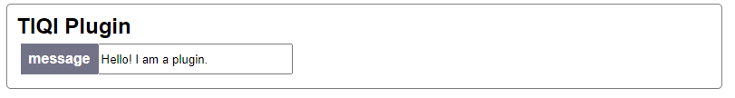

# Installation

## Requirements

slapdash requires Python 3.6+ because it uses type annotation and [FastAPI](https://fastapi.tiangolo.com/) and [Starlette](https://www.starlette.io/) to generate the web backend.

### Optional (Virtual Environment)

We recommend setting up a [virtual environment](https://docs.python.org/3/tutorial/venv.html). It basically creates a clean install of python without any additional packages, which can make debugging much easier.

```bash
python3 -m venv slapdash-venv
source slapdash-venv/bin/activate
```

Now if you run `python` or `pip` it will only see the packages you have installed in this virtual environment. To leave the virtual environment use `deactivate`.

### Development

You can also develop the Python package by using poetry and installing with `poetry install`. Optional packages used in the examples can be installed in a similar way with they keyword `examples`. Development dependencies will automatically be installed. Alternatively, you can develop using this package as a dependency in development mode as part of another repository.

Perform tests with `poetry run pytest`, for example. See `pytest` documentation for further options.

To develop the frontend, go to `./frontend` and run `npm install`, then `npm run start` to test changes in real time, and `npm run build` to finally build.

## Install

`pip` will install most slapdash dependencies automatically, or you can use `poetry`. When using `slapdash` as a dependency in another project through `poetry`, you will need `poetry>1.2.0` in order to resolve the dependency grouping properly.

```bash
pip install wheel
pip install git+https://github.com/cathaychris/slapdash
```

If you get an error you might need to first install `wheel` and `setuptools` using `pip`.

## Examples

Run

```bash
python -m slapdash.examples
```

to see a list of the available examples and run them. Try `python -m slapdash.examples hello_world`. You should see

```bash
INFO:     Started server process [10257]
INFO:     Waiting for application startup.
INFO:     Application startup complete.
INFO:     Uvicorn running on http://0.0.0.0:8000 (Press CTRL+C to quit)
```

And if you open http://localhost:8000 with a browser you should be greeted by the automatically generated frontend.

